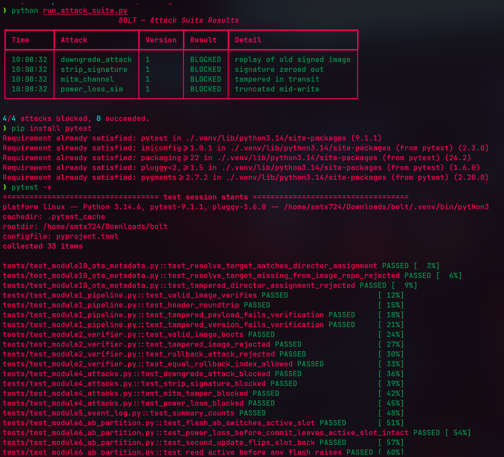

# BOLT — Boot & OTA Lockdown Toolkit


Secure OTA update and boot integrity framework for automotive ECUs, simulated
entirely in software: signed firmware images, rollback protection, and an
attacker toolkit that tries to break both.

## Structure
```
pipeline/    signing pipeline — keygen, PKI/cert chain, image builder, manifest, OTA metadata, CLI
bootloader/  verifier, rollback store, A/B partitions, virtual flash, cert chain validation
attacks/     downgrade, signature-strip, MITM, power-loss attacks
detector/    event log + Rich dashboard for attack suite results
tests/       pytest suite covering all of the above
```

See [docs/ARCHITECTURE.md](docs/ARCHITECTURE.md) for trust chain, update flow,
and flash layout diagrams.

## Image format
```
[4 bytes header length][JSON header: version, rollback_index, sig][payload]
```
Signature: RSA-PSS/SHA-256 over `version || rollback_index || payload`.

## Trust model
Firmware images are trusted through an X.509 chain: a root CA (offline,
long-lived) signs a short-lived OEM signing certificate, and the OEM cert's
key signs images, version manifests, and OTA metadata. `Verifier.from_cert_chain`
validates the full chain — issuer match, signature, and validity window —
before trusting any image signature. A single compromised or leaked signing
key can be rotated by issuing a new OEM cert without touching the root.

## Version manifests
`pipeline/manifest.py` produces a signed manifest per ECU listing target
firmware names, lengths, and SHA-256 hashes — metadata about what should be
installed, independent of the image bytes themselves.

## OTA metadata (Uptane-inspired, not spec-compliant)
`pipeline/ota_metadata.py` splits update authority into two independently
signed roles — a director (assigns a target to an ECU) and an image
repository (attests to what targets exist) — modeled loosely on
[Uptane](https://uptane.github.io/)'s role separation. See
[docs/ARCHITECTURE.md](docs/ARCHITECTURE.md) for what this does and doesn't
cover.

## Usage
```
pip install -e ".[dev]"
python -m pipeline.cli keygen --out keys
python -m pipeline.cli sign fw.bin --version 1 --rollback-index 1 --key keys/oem_key_private.pem
pytest tests/ -v
ruff check .
mypy pipeline bootloader attacks detector
```

## A/B partitioning
Every flash targets the inactive slot. Rollback commit and slot activation only
happen after signature and rollback checks pass, so a crash or truncated write
mid-flash never touches the currently active, known-good image.

`bootloader/flash.py` and `bootloader/flash_ecu.py` model this against a
single byte-addressed virtual flash file with named regions (bootloader,
slot_a, slot_b, rollback_counter, slot_state, manifest) rather than separate
JSON files, closer to how flash-backed ECUs actually lay out memory.

## Attack results

See [THREAT_MODEL.md](THREAT_MODEL.md) for what each attack models and why.

| Attack | Blocked? |
|---|---|
| Rollback / downgrade replay | Yes |
| Signature stripping | Yes |
| MITM tampering in transit | Yes |
| Power-loss mid-write truncation | Yes |

## Attack suite + dashboard
```
python run_attack_suite.py
```
Runs all four attacks against a fresh signer/verifier pair and renders a Rich
terminal table with per-attack results and a summary line.

## License
MIT — see [LICENSE](LICENSE).


## Attack Suite Results

<p align="center">
  
</p>

