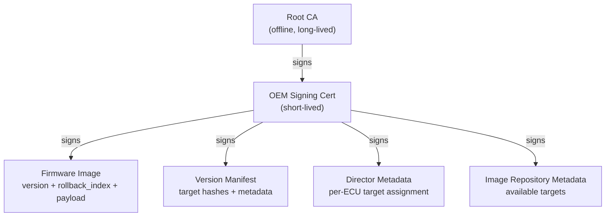
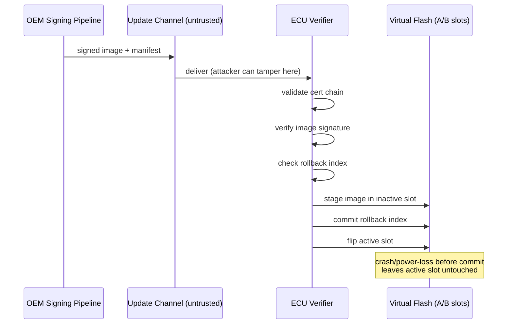
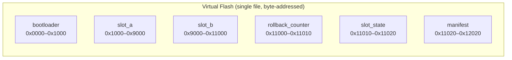

# Architecture

## Trust chain

## Update flow

## Flash memory layout

## Uptane-inspired split (not spec-compliant)

BOLT's `pipeline/ota_metadata.py` borrows the director/image-repository
role separation from [Uptane](https://uptane.github.io/) at a conceptual
level: a director asserts which target an ECU should install, and an
image repository independently attests to what targets exist and their
hashes. Resolving an update requires both to agree. This is a simplified
two-role model for illustrating the idea — it does not implement Uptane's
full TUF-based role hierarchy (root/targets/snapshot/timestamp), key
thresholds, or delegation structure.
